# 司命（Siming）剧情对话编辑器产品需求文档

| 文档信息   | 内容                                                                                      |
| ---------- | ----------------------------------------------------------------------------------------- |
| 文档版本   | v1.0                                                                                      |
| 产品版本   | MVP + 后续路线图                                                                          |
| 目标读者   | 产品、设计、研发、测试                                                                    |
| 产品形态   | Windows / macOS / Linux 桌面应用与独立 CLI                                                |
| 在线交互稿 | [司命（Siming）剧情对话编辑器](https://siming-dialogue-editor.sunyingyingmu.chatgpt.site) |
| 配套文档   | [技术方案](./技术方案.md)                                                                 |

> 本文档以最终交互稿和技术方案为共同依据。交互稿用于说明界面、状态和操作方式；本文档中的版本标记、业务规则和验收标准用于确定实际交付范围。

## 一、产品定义

### 1.1 产品背景

剧情向游戏的对话内容通常同时包含角色对白、玩家选项、变量条件、游戏事件、多语言文本和引擎侧表现逻辑。使用普通表格或手写 JSON 管理这些内容时，容易出现分支关系不直观、引用失效、多人协作路径冲突、运行时格式和编辑格式互相污染等问题。

司命（Siming）是一款本地优先、与游戏引擎无关的剧情对话编辑器。它通过节点画布表达剧情结构，通过表格模式支持连续阅读，通过数据模式开放真实源结构，并提供校验、模拟运行、多语言和稳定导出能力。

### 1.2 产品目标

1. 让叙事设计师无需编写代码即可创建和维护带分支的剧情对话。
2. 让程序、技术策划和测试能够查看真实数据、定位错误并重复验证运行结果。
3. 使用稳定 UUID、相对路径和确定性导出降低版本控制中的无意义冲突。
4. 通过统一运行时结构对接 Unity、Unreal Engine 或自研引擎。
5. 让桌面端和 CLI 共享同一套校验、迁移和导出语义。

### 1.3 目标用户

| 用户       | 核心任务                                 | 主要入口              |
| ---------- | ---------------------------------------- | --------------------- |
| 叙事设计师 | 编辑对白、选项、条件、标签和多语言文本   | 画布、表格、属性面板  |
| 技术策划   | 配置变量、业务事件、宿主消息和运行时数据 | 资源编辑器、数据视图  |
| 程序开发   | 接入运行时 JSON、业务事件和宿主回调      | 数据预览、CLI、导出器 |
| 测试人员   | 校验结构、模拟不同分支、定位错误节点     | 校验中心、模拟运行器  |
| 本地化人员 | 补全翻译、检查缺失文本                   | 多语言字段、翻译筛选  |

### 1.4 产品原则

- **本地优先**：项目源文件保存在用户选择的目录中，不依赖云端账号。
- **单一数据模型**：画布、表格和数据视图编辑同一份文档，不维护互相覆盖的副本。
- **显式语义**：选项、条件和业务事件使用明确字段及端口，不依赖数组顺序猜测业务含义。
- **协作友好**：项目路径使用相对路径；实体使用稳定 UUID；导出结果保持确定性。
- **安全可恢复**：无效数据不覆盖最后有效文档，保存使用原子写入并提供恢复快照。
- **引擎无关**：编辑器不执行任意游戏代码，运行时数据由引擎适配层消费。

### 1.5 MVP 范围

**MVP 必须交付：**

- 本地项目、对话目录和四类项目资源管理。
- 六类节点、连线、画布、表格和数据三种视图。
- 文件属性、节点属性、稳定 UUID、标签和多宿主消息。
- 结构校验、模拟运行、内容多语言，以及 JSON、XML、二进制运行时导出。
- 项目设置、用户设置、相对路径和 `Dark` / `Light` 主题。
- `validate`、`export`、`migrate`、`info` CLI 命令。
- Windows、macOS桌面应用和独立 CLI 产物。

**后续版本：**

- 编辑器界面多语言。
- Unity、Unreal Engine 官方运行时插件。
- 多人实时协作、云同步、账号权限和翻译平台接入。
- Excel、CSV、XLIFF、Ink、Yarn Spinner 等格式转换。

**不在 MVP 内：**

- 游戏内 UI、立绘、动画、Timeline 和音频播放实现。
- 完整脚本语言或任意代码执行。
- 由宿主消息返回值直接控制对话分支。

## 二、交互与功能修改总结

| 主题     | 已确认修改                                                           | 产品价值                                           |
| -------- | -------------------------------------------------------------------- | -------------------------------------------------- |
| 内容管理 | 对话列表升级为真实目录树，并增加最近编辑、错误、翻译未完成等智能分组 | 大项目仍可管理，真实路径与版本控制一致             |
| 项目资源 | 增加角色、变量、业务事件、标签四类独立编辑器                         | 集中维护定义并保护引用                             |
| 搜索     | 主导航增加独立项目搜索页面                                           | 统一检索文件、节点和资源                           |
| 编辑视图 | 从画布/数据双视图扩展为画布/表格/数据三视图                          | 同时满足结构编辑、连续阅读和高级数据编辑           |
| 画布交互 | 增加鼠标滚轮或触摸板缩放、拖动画布、适应视图和小地图                 | 提升大图导航效率                                   |
| 属性面板 | 未选择节点时默认展示当前对话文件属性                                 | 文件级描述、标签和路径拥有明确编辑入口             |
| 标识规则 | 节点和对话使用自动生成、不可变的 UUID，并保留可读 Key                | 避免重复 ID 和重命名破坏引用                       |
| 分支结构 | 普通节点使用单一 `next`，选项和条件使用具名目标                      | 运行时无需猜测多个出口的语义                       |
| 多语言   | 增加语言切换、翻译完成度、缺失标记和固定回退顺序                     | 内容可直接进入本地化生产                           |
| 导出     | 主按钮与格式菜单组成分体按钮                                         | 保留 JSON 快速导出并容纳后续格式                   |
| 设置     | 区分项目设置和用户设置，项目目录支持相对路径                         | 避免把本机路径提交到团队仓库                       |
| 主题     | 用户设置提供 `Dark`、`Light` 两种主题并立即生效                      | 适应不同工作环境                                   |
| 宿主扩展 | 每个节点支持多条有序 `hostEvents`                                    | 让 Unity、UE 等宿主响应 UI、镜头、埋点等自定义逻辑 |
| 工具闭环 | 增加校验中心、模拟运行器和 CLI                                       | 编辑、验证、构建形成完整闭环                       |

## 三、信息架构与核心流程

### 3.1 总体界面


图 1：顶部提供视图、语言、校验、模拟和导出操作；最左侧为主导航；左侧内容区管理对话和项目资源；中间为工作区；右侧为属性面板；底部为问题、模拟和 CLI 面板。

### 3.2 核心生产流程


```mermaid
flowchart LR
    A["新建或打开项目"] --> B["创建目录与对话文件"]
    B --> C["编辑节点、连线与资源"]
    C --> D["补充多语言与宿主消息"]
    D --> E["结构校验"]
    E -->|存在错误| C
    E -->|通过| F["模拟运行分支"]
    F -->|结果不符合预期| C
    F -->|通过| G["保存项目"]
    G --> H["导出运行时 JSON"]
    H --> I["Unity / UE / 自研引擎加载"]
```

### 3.3 主导航

| 入口     | 打开内容                       | 选中状态                   |
| -------- | ------------------------------ | -------------------------- |
| 对话     | 当前对话的画布、表格或数据视图 | 同步选中当前对话文件       |
| 角色     | 角色资源列表和属性             | 取消对话节点选择           |
| 变量     | 变量资源列表和属性             | 取消对话节点选择           |
| 业务事件 | 业务事件定义列表和参数 Schema  | 取消对话节点选择           |
| 标签     | 标签定义、范围和引用           | 取消对话节点选择           |
| 搜索     | 全项目搜索工作区               | 清除文件和资源列表选中状态 |
| 设置     | 项目设置和用户设置             | 顶部三种编辑视图暂时禁用   |

## 四、详细功能需求

### 4.1 项目管理

**版本：MVP**

**目标与用户故事：** 用户可以创建、打开、保存和恢复一个完全位于本地文件系统的剧情项目，并能在不同设备和仓库路径下正常工作。

**入口与界面：**

- 应用启动页提供“新建项目”“打开项目”和最近项目列表。
- 打开项目后进入图 1 所示主界面。
- 顶部脏状态圆点表示当前项目存在未保存修改。

**主流程：**

1. 新建项目时选择项目根目录、项目名称、默认语言。
2. 系统生成项目配置、默认资源文件、`dialogues/` 和第一份对话。
3. 打开项目时读取 Schema 版本并执行完整校验。
4. 保存时先处理数据视图草稿，再进行业务校验、临时写入、刷盘和原子替换。
5. 退出、切换项目或关闭窗口时统一拦截未保存修改。

**规则与异常：**

- 最近项目中的绝对路径只保存在本机用户配置。
- 项目内不保存项目根目录的绝对路径。
- 项目格式版本高于应用支持版本时以只读方式打开。
- 项目文件被外部修改时提示“重新加载”“保留当前版本”或“另存”。
- 保存失败不得损坏原文件，并保留可再次保存的编辑状态。
- 异常退出后再次启动时提示恢复快照。

**验收标准：**

- 新建项目后目录和初始文件完整，关闭重开后内容一致。
- 将项目复制到另一绝对路径后仍能正常打开、保存和导出。
- 模拟写入失败时原文件保持不变。
- 存在未应用数据草稿时不允许静默保存。

### 4.2 对话目录与文件管理

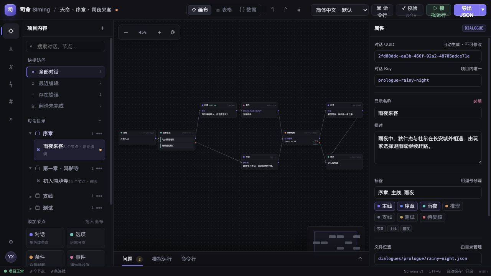

图 2：左侧同时提供虚拟智能分组和与磁盘一致的真实目录树；对话行展示节点数量、最近编辑时间及错误状态。

**版本：MVP**

**功能说明：**

- 创建、重命名、复制和删除对话文件。
- 创建、重命名、展开、收起和删除空目录。
- 将对话拖拽到其他目录，或通过目录菜单在指定目录新建对话。
- 支持“全部对话、最近编辑、存在错误、翻译未完成”等智能分组。
- 搜索名称、UUID、Key、标签和相对路径。

**目录交互流程：**

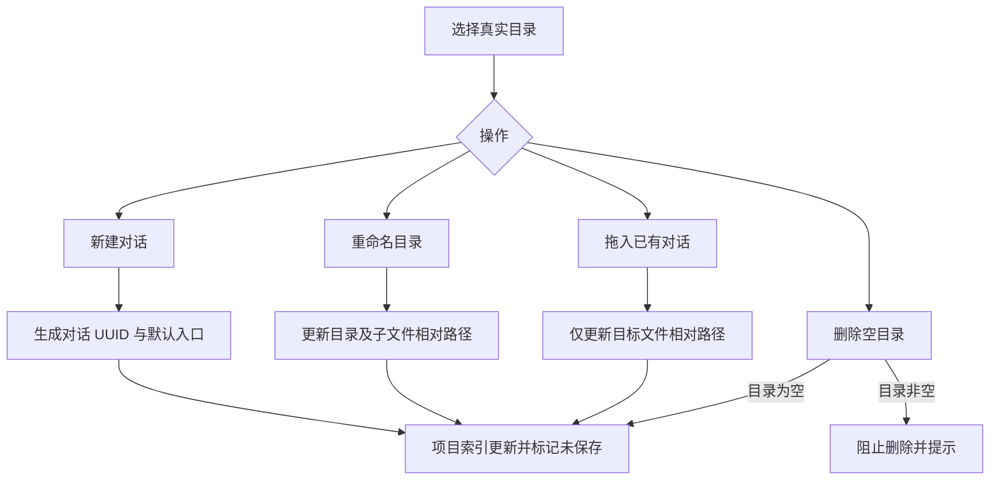
```mermaid
flowchart TD
    A["选择真实目录"] --> B{"操作"}
    B --> C["新建对话"]
    B --> D["重命名目录"]
    B --> E["删除空目录"]
    B --> F["拖入已有对话"]
    C --> G["生成对话 UUID 与默认入口"]
    D --> H["更新目录及子文件相对路径"]
    F --> I["仅更新目标文件相对路径"]
    G --> J["项目索引更新并标记未保存"]
    H --> J
    I --> J
    E -->|目录非空| K["阻止删除并提示"]
    E -->|目录为空| J
```

**规则与异常：**

- 目录树必须与 `dialogues/` 下真实磁盘结构一致。
- 目录建议不超过 3 层；交叉分类使用标签而非无限嵌套。
- 移动文件不得改变对话 UUID、节点 UUID、文本键和跨文件引用。
- 虚拟分组只改变筛选结果，不改变磁盘路径。
- 删除对话前展示受影响文件和跨文件引用；存在强引用时默认阻止删除。
- 重复 UUID、Key 或相对路径会阻止保存。

**验收标准：**

- 拖拽文件后目标目录、项目索引和属性面板路径同步更新。
- 智能分组筛选正确且不修改真实目录。
- 非空目录不能被直接删除。
- 移动和重命名后稳定标识及文本键保持不变。

### 4.3 项目搜索

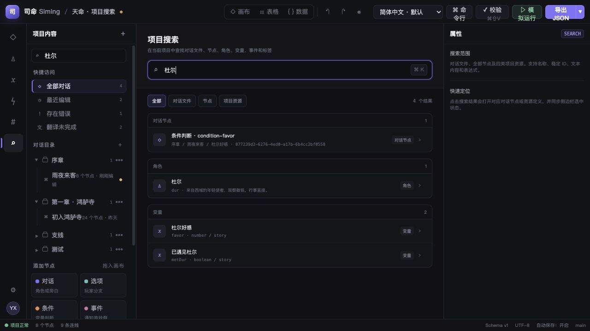

图 3：搜索结果按对话文件、节点和项目资源分组，点击后打开对应编辑器并定位目标。

**版本：MVP**

**功能说明：**

- 主导航搜索入口和侧边栏快速搜索框打开同一搜索工作区。
- 支持按“全部、对话文件、节点、项目资源”筛选。
- 搜索显示名称、稳定 ID、对白文本、条件表达式、业务事件名、标签和说明。
- 搜索结果展示类型、所属文件或资源路径。
- 点击结果后打开目标文件、选中节点或打开资源定义。
- `Command/Ctrl + K` 聚焦搜索。

**状态与异常：**

- 无关键词时展示最近内容。
- 无匹配结果时展示空状态和可搜索字段提示。
- 目标在已折叠目录中时自动展开其父目录。
- 当前数据视图存在未应用草稿时，离开前执行切换拦截。

**验收标准：**

- 同一关键词可同时命中对白、节点 Key 和资源定义。
- 筛选按钮只改变结果类型，不修改原始数据。
- 点击节点结果后画布和属性面板选中同一 UUID。

### 4.4 项目资源管理

#### 4.4.1 角色

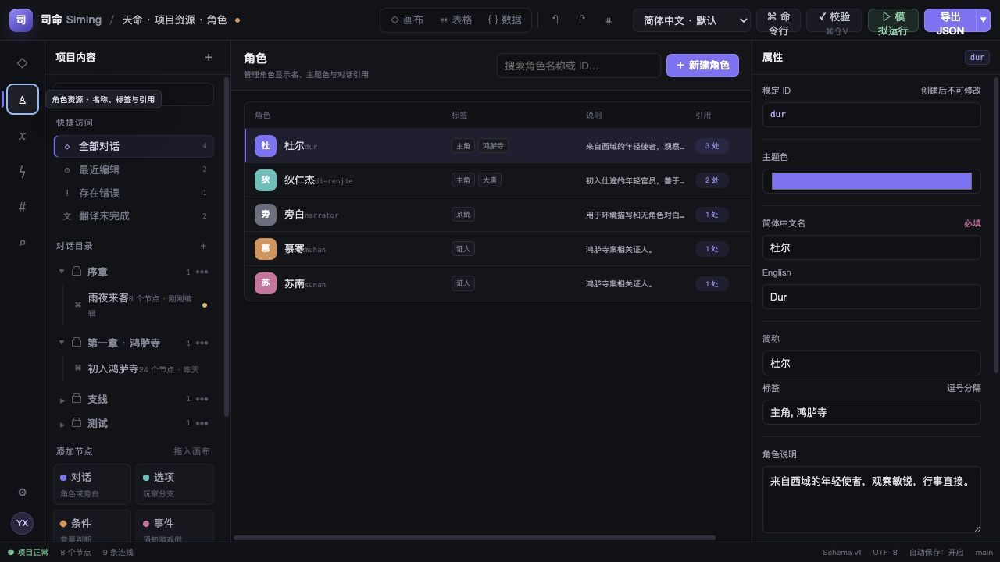

图 4：角色列表展示头像色、名称、标签、说明和引用次数；右侧编辑稳定 ID、多语言名称和角色属性。

**字段：** 稳定 ID、多语言显示名、简称、主题色、描述、标签、引用列表。

**规则：**

- 稳定 ID 创建后默认不可直接修改。
- 角色名称支持项目全部内容语言。
- 删除前检查对话节点中的 `speakerId` 引用。
- 点击引用可跳转到具体对话节点。

#### 4.4.2 变量

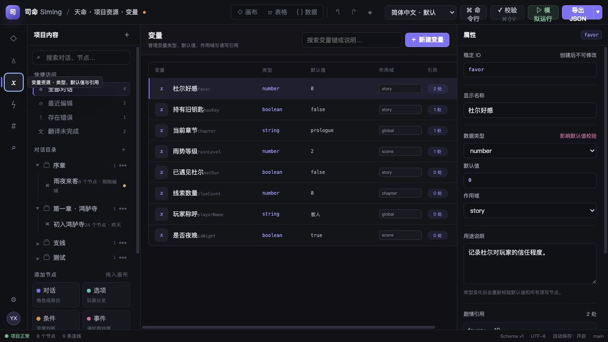

图 5：变量列表展示类型、默认值、作用域和引用；右侧配置类型、范围和说明。

**字段：** Key、显示名、`boolean | number | string` 类型、默认值、作用域、说明、可选数值范围。

**规则：**

- 默认值必须匹配变量类型。
- 修改类型前检查全部条件和业务事件参数引用。
- 不兼容引用会阻止保存并提供定位入口。
- 条件节点只能选择已定义变量。

#### 4.4.3 业务事件

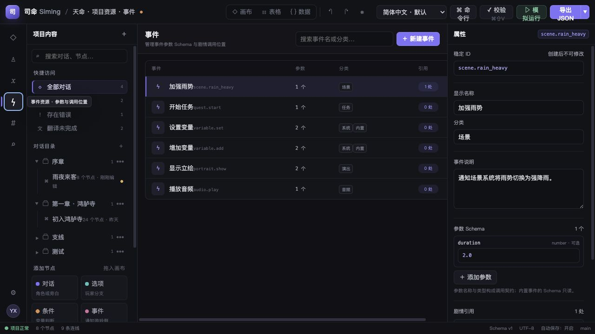

图 6：业务事件编辑器管理事件名称、分类、参数 Schema 和调用位置。

**字段：** 事件名、显示名称、分类、说明、内置标记、参数名称、类型、必填、默认值和说明。

**规则：**

- 业务事件是独立流程节点，执行到该节点时调用项目事件执行器。
- 业务事件必须符合项目事件定义及参数 Schema。
- 内置事件可查看但不能删除。
- 项目自定义事件可复制；删除前检查调用引用。

#### 4.4.4 标签

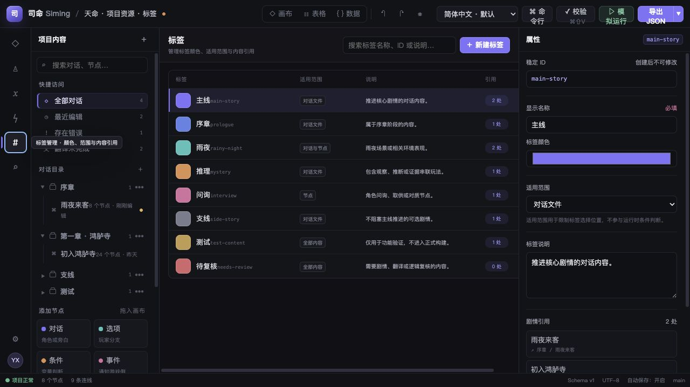

图 7：标签定义颜色、适用范围、说明和引用位置，可用于目录之外的交叉分类。

**字段：** 稳定 ID、显示名称、颜色、适用范围、说明、引用列表。

**规则：**

- 适用范围可限定为对话、节点、项目资源或全部内容。
- 标签只用于分类、筛选和搜索，不参与运行时条件。
- 重命名显示名称不改变稳定 ID。
- 存在引用时阻止直接删除。

#### 4.4.5 通用引用流程

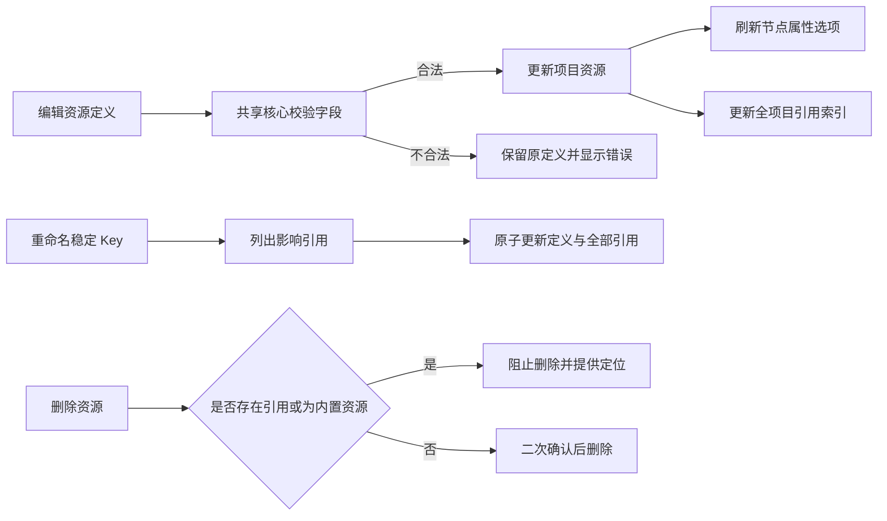
```mermaid
flowchart LR
    A["编辑资源定义"] --> B["共享核心校验字段"]
    B -->|合法| C["更新项目资源"]
    C --> D["刷新节点属性选项"]
    C --> E["更新全项目引用索引"]
    B -->|不合法| F["保留原定义并显示错误"]
    G["重命名稳定 Key"] --> H["列出影响引用"]
    H --> I["原子更新定义与全部引用"]
    J["删除资源"] --> K{"是否存在引用或为内置资源"}
    K -->|是| L["阻止删除并提供定位"]
    K -->|否| M["二次确认后删除"]
```

**资源模块验收标准：**

- 四类资源均支持搜索、新增、选择和属性编辑。
- 资源引用数量与实际项目引用一致。
- 受保护资源和被引用资源无法被误删。
- 资源修改进入统一撤销/重做及未保存状态。

### 4.5 项目设置

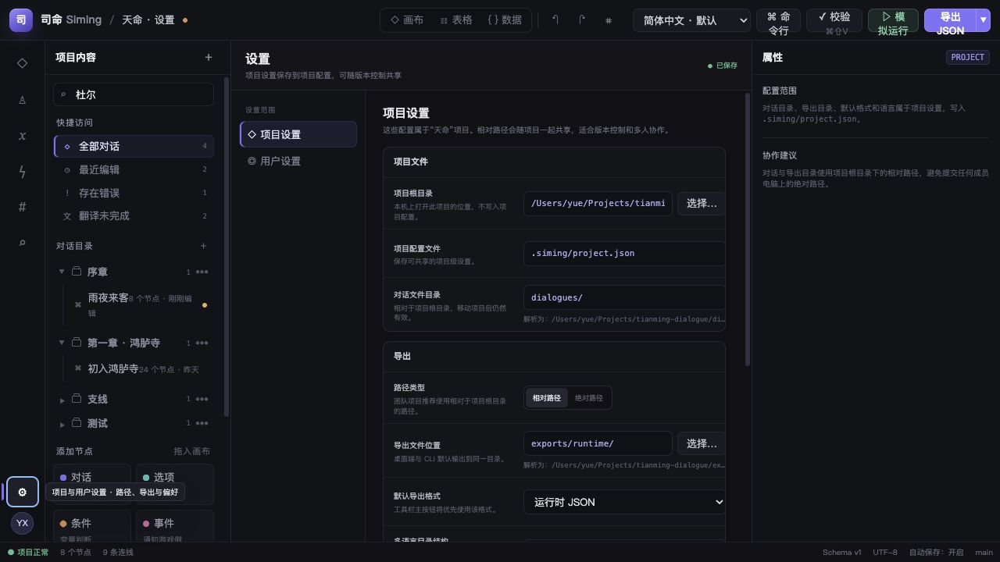

图 8：项目设置展示项目根目录、项目配置文件、对话目录、导出目录、导出格式和语言配置，并实时显示路径解析结果。

**版本：MVP**

**配置项：**

| 设置           | 作用域   | 默认值                 | 持久化     |
| -------------- | -------- | ---------------------- | ---------- |
| 项目根目录     | 当前设备 | 用户选择               | 不写入项目 |
| 项目配置文件   | 项目     | `.siming/project.json` | 项目文件   |
| 对话目录       | 项目     | `dialogues/`           | 项目配置   |
| 导出目录       | 项目     | `exports/runtime/`     | 项目配置   |
| 路径类型       | 项目     | 相对路径               | 项目配置   |
| 默认导出格式   | 项目     | 运行时 JSON            | 项目配置   |
| 多语言目录结构 | 项目     | 按语言拆分             | 项目配置   |
| 默认语言       | 项目     | `zh-CN`                | 项目配置   |
| 支持语言       | 项目     | `zh-CN, en-US`         | 项目配置   |

**规则与异常：**

- 相对路径以项目根目录为基准，统一使用 `/`。
- 默认禁止通过 `..` 逃逸项目根目录。
- 应用前检查路径格式、目录冲突和写入权限。
- 目录不存在时提示是否创建，不得静默写入未知位置。
- 绝对导出路径允许使用，但明确标记为本机配置风险。
- 桌面端和 CLI 默认读取同一项目设置。

### 4.6 用户设置与主题

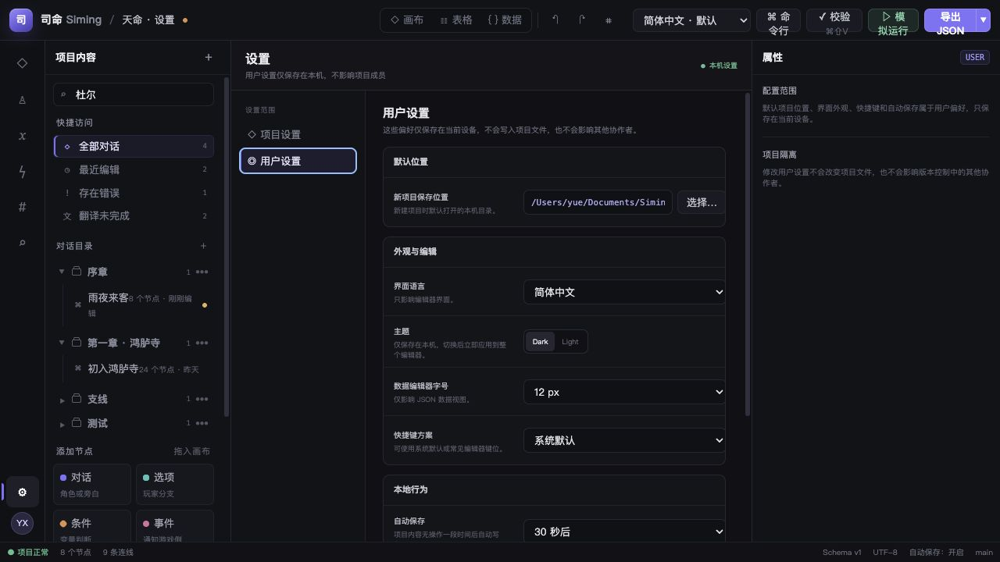

图 9：用户设置只保存在本机，包括新项目默认位置、界面偏好、快捷键和自动保存；主题仅提供 `Dark`、`Light`。

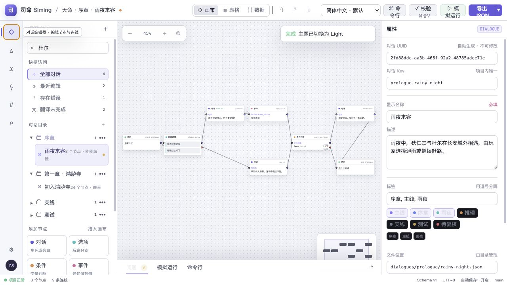

图 10：Light 主题作用于完整编辑器，而不是只改变设置页面；项目数据和导出结果不受影响。

**版本：MVP**

**配置项：** 新项目默认位置、界面语言入口、主题、数据编辑器字号、快捷键方案、自动保存间隔、启动时恢复策略。

**主题规则：**

- 主题枚举固定为 `dark | light`。
- 选择后立即作用于导航、目录、画布、节点、属性栏、表格、数据视图、资源、搜索、设置、底部面板和弹出菜单。
- 主题仅保存于本机用户配置，不进入项目文件。
- 重新打开应用时恢复上次选择。
- 恢复用户默认设置时主题回到 `Dark`。
- 主题不改变节点颜色语义、项目内容或导出结果。

**设置持久化边界：**

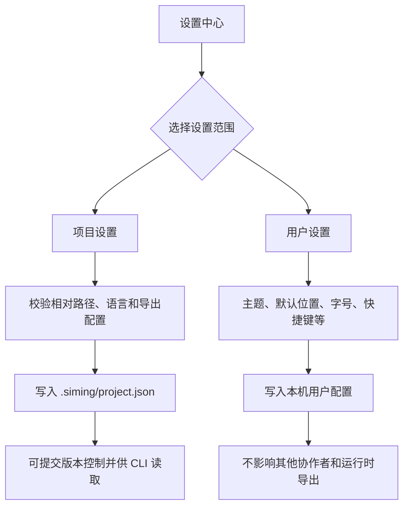
```mermaid
flowchart TD
    A["设置中心"] --> B{"选择设置范围"}
    B --> C["项目设置"]
    B --> D["用户设置"]
    C --> E["校验相对路径、语言和导出配置"]
    E --> F["写入 .siming/project.json"]
    F --> G["可提交版本控制并供 CLI 读取"]
    D --> H["主题、默认位置、字号、快捷键等"]
    H --> I["写入本机用户配置"]
    I --> J["不影响其他协作者和运行时导出"]
```

**验收标准：**

- 项目设置和用户设置在界面上有持续可见的作用域说明。
- 项目配置中不出现成员电脑的项目根绝对路径。
- Dark、Light 可立即切换，重新打开后保持，重置后恢复 Dark。

### 4.7 节点画布与连线

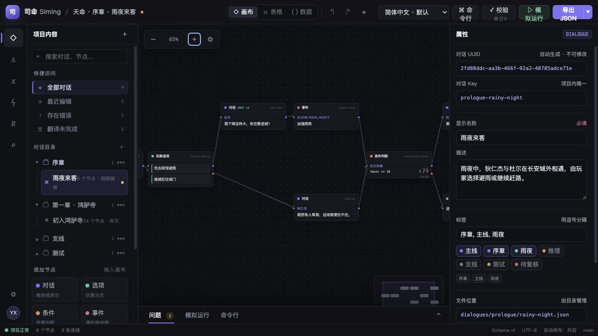

图 11：画布展示节点、具名端口和连线；左上角提供缩放、比例和居中操作，右下角提供小地图。

**版本：MVP**

**节点类型：**

| 类型             | 用途             | 出口                   |
| ---------------- | ---------------- | ---------------------- |
| 开始 `start`     | 对话入口         | 恰好一个 `next`        |
| 对话 `dialogue`  | 角色对白或旁白   | 恰好一个 `next`        |
| 选项 `choice`    | 玩家选择         | 每个选项一个同名出口   |
| 条件 `condition` | 根据变量判断     | `true`、`false` 各一个 |
| 业务事件 `event` | 执行项目业务事件 | 恰好一个 `next`        |
| 结束 `end`       | 结束当前对话     | 无出口                 |

**交互：**

- 从左侧节点面板点击或拖入画布创建节点。
- 单击节点选中并打开属性；点击画布空白取消选择。
- 拖拽节点更新坐标；拖拽端口创建连线。
- 鼠标滚轮或触摸板缩放；拖动画布空白区域进行平移。
- 支持框选、多选、复制、粘贴、删除和适应视图。
- 粘贴节点时生成新 UUID，并重建复制集合内的连线。

**标识与连线规则：**

- 节点 UUID 自动生成、不可变且在项目内唯一。
- Key 以字母开头，在当前文件唯一，可用于搜索和调试。
- 连线引用 UUID，不引用显示名称。
- 条件真假和选项目标由 `sourcePort` 明确表达。
- 禁止重复端口、悬空引用和无意义自连接。
- 循环必须经过明确节点路径，并由校验器提示风险。

**验收标准：**

- 连续创建或复制节点不会产生重复 UUID。
- 缩放和平移不会改变节点世界坐标或项目脏状态。
- 非法出口数量会立即提示并在完整校验中阻止导出。

### 4.8 表格阅读模式

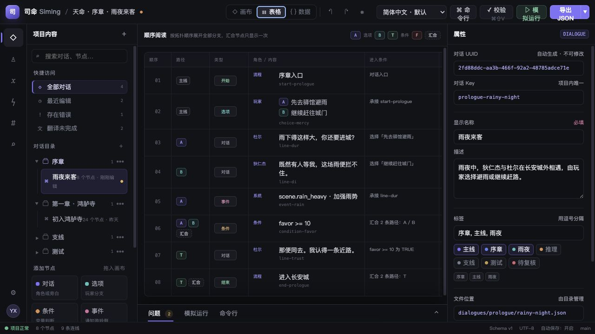

图 12：表格按拓扑顺序展示路径、类型、角色与正文、进入条件和下一节点；选项、条件、汇合使用明确标识。

**版本：MVP**

**功能说明：**

- 按拓扑顺序排列当前对话全部节点。
- 玩家选项使用 `A`、`B` 等路径标签。
- 条件分支使用 `TRUE`、`FALSE` 标签。
- 分支后续节点继承路径标签和缩进。
- 多条路径到达同一节点时只展示一次，并标记汇合来源。
- 循环节点只展开一次，并标记回跳目标。
- 点击表格行选中同一节点，并同步右侧属性面板和画布选择。

**验收标准：**

- 表格不因循环无限生成行。
- 汇合节点内容不重复复制。
- 在三种视图间切换后选择、文本和分支目标一致。

### 4.9 数据结构编辑器

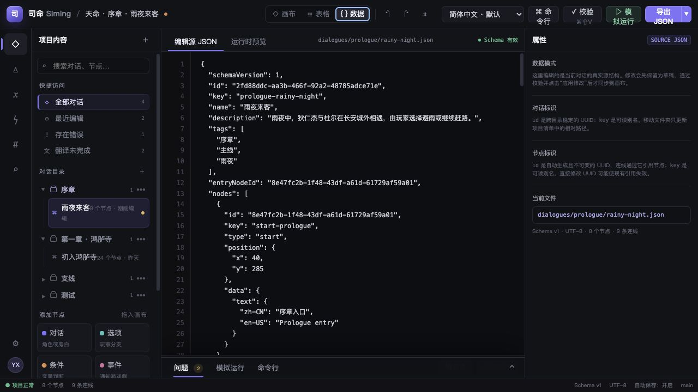

图 13：数据模式提供可编辑的源 JSON 和只读运行时预览，并显示文件路径、Schema 状态和应用操作。

**版本：MVP**

**功能说明：**

- “编辑源 JSON”展示当前对话真实编辑模型：节点、连线、坐标、多语言文本、UUID、Key 和宿主消息。
- “运行时预览”移除坐标等编辑器字段，生成稳定文本键和运行时跳转结构。
- 支持行号、格式化、搜索、缩进、括号匹配和错误定位。
- 输入修改先保存在独立草稿中。
- 只有通过 JSON、Schema 和完整业务校验并点击“应用修改”后，草稿才进入文档模型。

**三视图切换流程：**

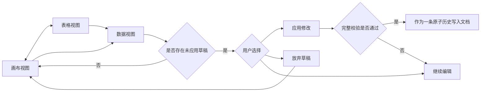
```mermaid
flowchart LR
    A["画布视图"] <--> B["表格视图"]
    A --> C["数据视图"]
    B --> C
    C --> D{"是否存在未应用草稿"}
    D -->|否| A
    D -->|是| E{"用户选择"}
    E --> F["应用修改"]
    E --> G["放弃草稿"]
    E --> H["继续编辑"]
    F --> I{"完整校验是否通过"}
    I -->|是| J["作为一条原子历史写入文档"]
    I -->|否| H
    G --> A
```

**规则与异常：**

- 无效草稿不得污染画布、表格、保存结果和导出结果。
- 运行时预览始终只读。
- 修改或删除被引用 UUID 会触发悬空引用错误。
- 应用源数据作为一条原子撤销记录。

### 4.10 文件与节点属性

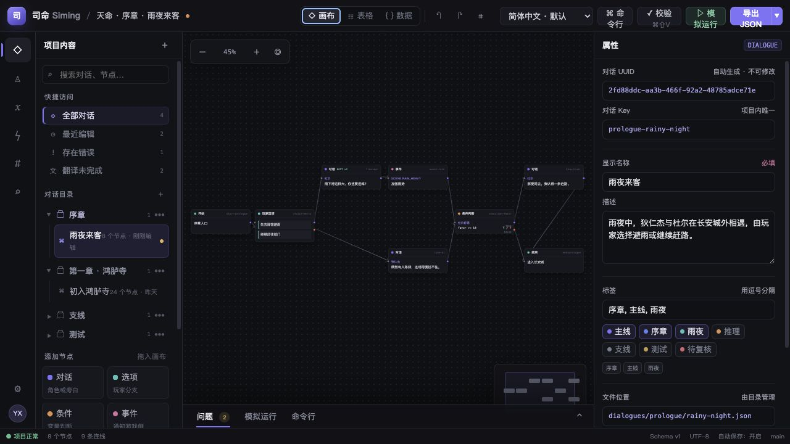

图 14：未选择节点时，属性面板展示当前对话的 UUID、Key、显示名称、描述、标签、文件位置和统计。

**对话文件字段：** 不可变 UUID、可读 Key、显示名称、描述、标签、相对路径、入口节点、节点和连线统计、语言完成度。

**节点字段：** 不可变 UUID、Key、节点类型字段、多语言正文、说话人、条件、业务事件、多宿主消息、暂停策略和画布显示偏好。

**规则：**

- 打开对话或点击画布空白时展示文件属性。
- 选中画布节点或表格行时展示节点属性。
- 文件描述和标签进入统一撤销/重做历史。
- 标签选择受标签适用范围约束。
- 切换对话时属性面板不得保留上一文件选择。

### 4.11 多宿主消息

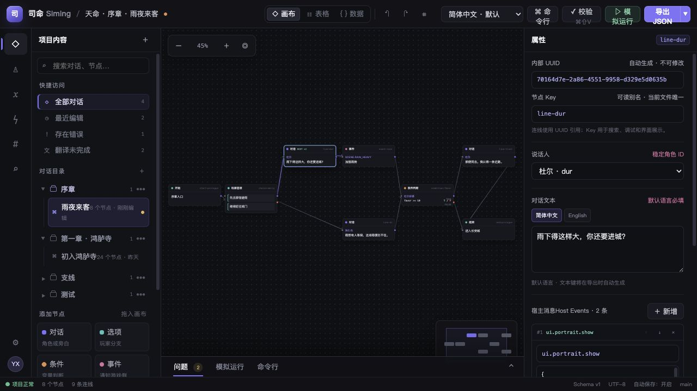

图 15：任意节点可配置多条宿主消息；列表显示广播顺序，并提供新增、上移、下移和删除。

**版本：MVP**

**数据结构：**

```json
{
  "hostEvents": [
    {
      "name": "ui.portrait.show",
      "payload": {
        "position": "left",
        "emotion": "serious"
      }
    },
    {
      "name": "camera.focus",
      "payload": {
        "target": "dur",
        "duration": 0.35
      }
    }
  ]
}
```

**功能和规则：**

- 所有六类节点均可配置零到多条消息。
- 每条消息独立配置名称和 JSON 对象参数。
- 消息名以字母开头，可包含字母、数字、点、横线和下划线。
- 数组顺序即广播顺序；上移、下移后立即更新数组。
- 每次进入节点时，在节点等待或跳转逻辑前逐条广播完整列表。
- 循环或重新进入节点时再次广播。
- 宿主消息不阻塞、不分支、不直接修改变量。
- 未注册消息由宿主安全忽略，可记录调试日志。
- 旧的单条 `hostEvent` 读取时迁移为单元素 `hostEvents`，保存后只写新字段。

**与业务事件节点的区别：**

| 对比项   | 宿主消息           | 业务事件节点           |
| -------- | ------------------ | ---------------------- |
| 数据字段 | `hostEvents[]`     | `event` + `params`     |
| 所属范围 | 任意节点的附加配置 | 独立节点类型           |
| 定义来源 | 宿主自行约定       | 项目事件资源           |
| 流程影响 | 单向通知，不阻塞   | 执行业务动作后继续流程 |
| 返回值   | 不参与分支         | MVP 同样不执行任意脚本 |

**执行路径：**

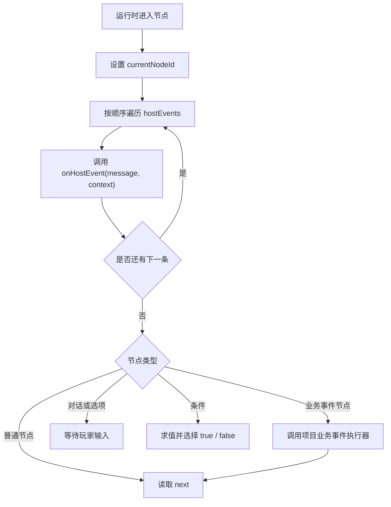
```mermaid
flowchart TD
    A["运行时进入节点"] --> B["设置 currentNodeId"]
    B --> C["按顺序遍历 hostEvents"]
    C --> D["调用 onHostEvent(message, context)"]
    D --> E{"是否还有下一条"}
    E -->|是| C
    E -->|否| F{"节点类型"}
    F -->|业务事件节点| G["调用项目业务事件执行器"]
    F -->|对话或选项| H["等待玩家输入"]
    F -->|条件| I["求值并选择 true / false"]
    F -->|普通节点| J["读取 next"]
    G --> J
```

**验收标准：**

- 新增、删除、上移、下移后源数据和运行时预览顺序一致。
- 同一次节点访问按数组顺序广播且每项恰好一次。
- 某条宿主消息无监听器时后续消息和节点流程仍继续。
- 宿主消息不会被业务事件执行器误处理。

### 4.12 校验中心

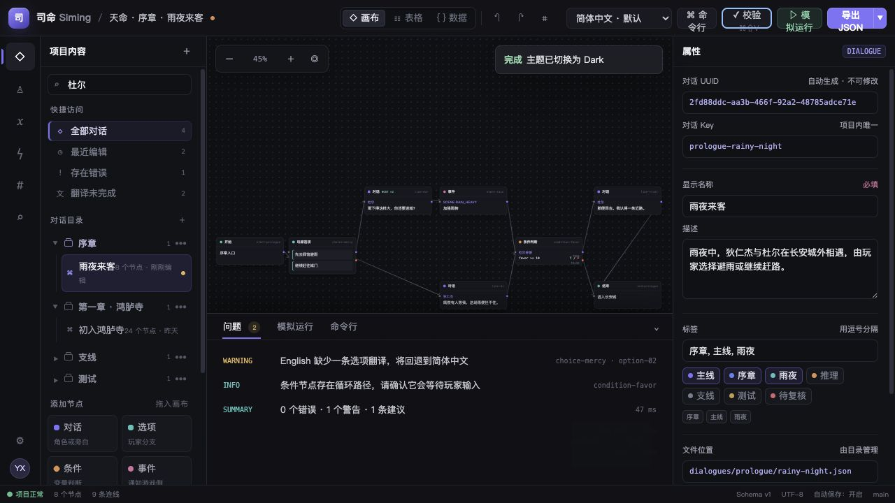

图 16：问题面板按严重级别展示诊断、目标路径和汇总；点击诊断定位对应节点。

**版本：MVP**

**错误（阻止保存或导出）：**

- JSON 或 Schema 无效。
- 重复或非法 UUID、Key、路径。
- 入口节点不存在或类型不是开始节点。
- 连线引用不存在节点，端口重复或出口数量不合法。
- 条件表达式字段或类型不合法。
- 角色、变量、业务事件、标签引用失效。
- 宿主消息名或参数格式无效。

**警告（允许保存，导出时明确提示）：**

- 不可达节点。
- 无用户等待点的潜在死循环。
- 非默认语言缺失翻译。
- 未使用资源或未被引用对话。

**交互：**

- 顶部“校验”执行项目级校验并展开问题面板。
- 诊断包含级别、可读消息、对话/节点路径和稳定 ID。
- 点击诊断打开目标对话并选中节点。
- CLI 输出与桌面端使用相同诊断代码。

### 4.13 模拟运行器

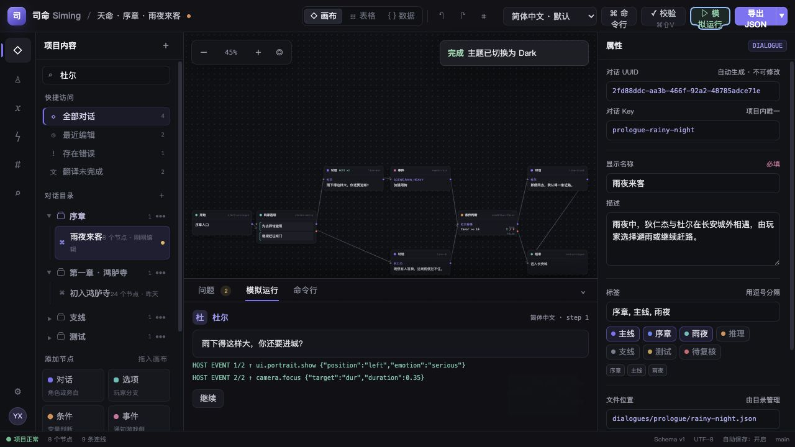

图 17：模拟器展示当前说话人、正文和玩家选项，并按顺序记录进入节点时广播的宿主消息。

**版本：MVP**

**功能说明：**

- 从入口节点或当前选中节点开始运行。
- 临时覆盖变量值，不回写项目默认值。
- 展示当前语言正文、回退状态、玩家选项和执行轨迹。
- 条件节点使用共享条件求值器。
- 业务事件记录名称和参数，但不执行真实游戏逻辑。
- 宿主消息按顺序写入模拟日志。
- 可重新开始、单步推进和切换预览语言。

**安全规则：**

- 限制无用户输入的最大连续步数。
- 检测死循环后暂停并提供最后执行节点。
- 缺失翻译按固定顺序回退并显示标记。
- 模拟上下文与项目源数据隔离。

**验收标准：**

- 同一变量输入和玩家选择得到稳定路径。
- 修改临时变量可进入不同条件分支。
- 停止模拟后项目变量默认值不变。
- 死循环不会锁死编辑器。

### 4.14 内容多语言

**版本：MVP**

**功能说明：**

- 项目设置一个默认语言并配置多个支持语言。
- 对话正文、选项文本和角色显示名使用相同多语言字段结构。
- 顶部语言选择器切换画布、表格、属性和模拟器的预览语言。
- 显示整体和字段级翻译完成度。
- “翻译未完成”智能分组筛选存在缺失文本的对话。

**回退顺序：**

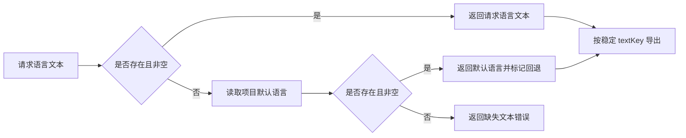
```mermaid
flowchart LR
    A["请求语言文本"] --> B{"是否存在且非空"}
    B -->|是| C["返回请求语言文本"]
    B -->|否| D["读取项目默认语言"]
    D --> E{"是否存在且非空"}
    E -->|是| F["返回默认语言并标记回退"]
    E -->|否| G["返回缺失文本错误"]
    C --> H["按稳定 textKey 导出"]
    F --> H
```

**稳定文本键：**

- 文本键基于对话 UUID、节点 UUID 和选项 ID。
- 修改文本、Key、显示名称、目录和坐标不会改变文本键。
- 复制节点生成新 UUID，因此生成新文本键。
- 各语言资源使用相同文本键集合。

### 4.15 导出器

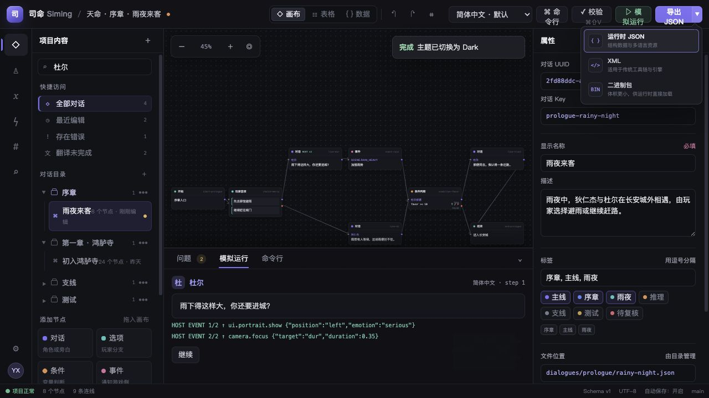

图 18：主按钮快速导出 JSON；下拉菜单展示运行时 JSON、XML 和二进制入口，并说明适用场景。

**格式与组织方式：**

- 支持 JSON、XML 和二进制正式导出。
- `bundled` 保持全项目合并产物，兼容已有宿主。
- `directoryChunks` 按对话一级目录拆分结构和语言资源，供宿主按章节或场景加载；新项目默认使用。

**导出流程：**

1. 检查不存在未应用数据草稿。
2. 执行完整项目校验；错误阻止导出。
3. 将编辑源模型编译为运行时模型。
4. 移除坐标、选中状态等编辑器字段。
5. 按稳定文本键拆分各语言资源；目录分片模式再按一级对话目录分组。
6. 生成轻量项目索引和所选格式的结构、公共语言、对话语言产物。
7. 使用稳定字段和实体顺序序列化，并原子替换项目设置中的导出目录。

**运行时分支契约：**

- 普通节点：`next: nodeUuid`。
- 选项节点：每个 `choices[i].next` 对应玩家所选项。
- 条件节点：`branches.true` 和 `branches.false`。
- 结束节点：无跳转字段。
- 宿主消息：保留有序 `hostEvents` 数组。

**验收标准：**

- 相同输入多次导出字节一致。
- 导出结构不包含画布坐标。
- 导出目录相对项目根目录正确解析。
- JSON 通过发布的合并或分片 Schema，XML 可正常解析，二进制分片可独立校验。

### 4.16 CLI

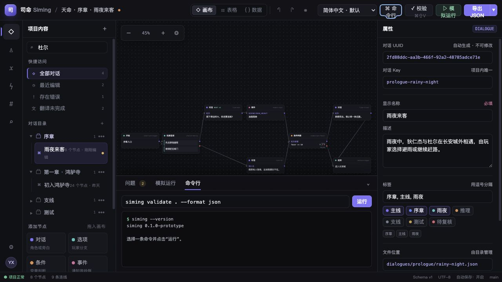

图 19：底部命令面板展示 CLI 输入和结构化输出；正式 CLI 可脱离桌面应用运行。

**版本：MVP**

| 命令                     | 用途               | 关键选项                                       |
| ------------------------ | ------------------ | ---------------------------------------------- |
| `siming validate [path]` | 校验项目或文件     | `--format text                                 | json`、`--warnings-as-errors` |
| `siming export [path]`   | 导出运行时数据     | `--output`、`--format`、`--layout`、`--pretty` |
| `siming migrate [path]`  | 检查或执行迁移     | `--check`、`--backup-dir`                      |
| `siming info [path]`     | 输出项目版本和统计 | `--format text                                 | json`                         |

**退出码：**

- `0`：成功且没有导致失败的诊断。
- `1`：校验失败或警告被视为错误。
- `2`：参数、路径或项目版本错误。
- `3`：未预期内部错误。

**规则：**

- 默认项目路径为当前目录。
- JSON 输出固定包含版本、命令、成功状态、诊断和结果。
- 标准输出只写机器结果，日志写标准错误。
- 桌面端和 CLI 使用共享核心，诊断和导出内容必须一致。

### 4.17 撤销、重做、快捷键与恢复

**版本：MVP**

**功能说明：**

- 节点创建、移动、删除、连线、字段修改、资源修改、目录移动和数据应用进入统一历史。
- 连续文本输入在短时间内合并，失焦后结束合并。
- 拖拽操作只在结束时生成一条历史记录。
- 保存不清空历史，以保存位置判断脏状态。
- 数据视图“应用修改”作为一条原子操作。

**基础快捷键：**

| 操作      | macOS                               | Windows / Linux       |
| --------- | ----------------------------------- | --------------------- |
| 保存      | `Command + S`                       | `Ctrl + S`            |
| 撤销/重做 | `Command + Z / Shift + Command + Z` | `Ctrl + Z / Ctrl + Y` |
| 搜索      | `Command + K`                       | `Ctrl + K`            |
| 复制/粘贴 | `Command + C / V`                   | `Ctrl + C / V`        |
| 删除      | `Delete`                            | `Delete`              |
| 校验      | `Command + Shift + V`               | `Ctrl + Shift + V`    |

**异常恢复：**

- 自动恢复快照写入应用数据目录，不污染项目仓库。
- 正常保存后清理对应快照。
- 恢复前展示项目、文件、快照时间和差异摘要。
- 恢复内容进入未保存状态，用户明确保存后才覆盖源文件。

### 4.18 跨平台要求

**版本：MVP**

- Windows、macOS、Linux 均能安装、启动、打开项目、保存、校验和导出。
- 路径显示遵循当前系统习惯，项目内部序列化统一使用 `/`。
- 快捷键根据操作系统映射，但业务行为一致。
- UTF-8 项目在三平台读写结果一致。
- 文件替换、权限错误和文件锁使用平台适配实现。
- CLI 可单独解压运行，不依赖桌面窗口和前端资源。
- 三平台对同一固定项目产生相同运行时导出。

## 五、运行时与数据契约

### 5.1 编辑源结构与运行时结构

| 内容       | 编辑源              | 运行时                                      |
| ---------- | ------------------- | ------------------------------------------- |
| 节点坐标   | 保留                | 移除                                        |
| 多语言原文 | 保留                | 替换为稳定文本键                            |
| 连线       | 独立 `edges[]`      | 编译为 `next`、`choices[].next`、`branches` |
| UUID / Key | 都保留              | UUID 作为索引，Key 用于日志                 |
| 宿主消息   | `data.hostEvents[]` | 节点 `hostEvents[]`                         |
| 编辑器状态 | 必要偏好可保留      | 全部移除                                    |

### 5.2 节点运行流程

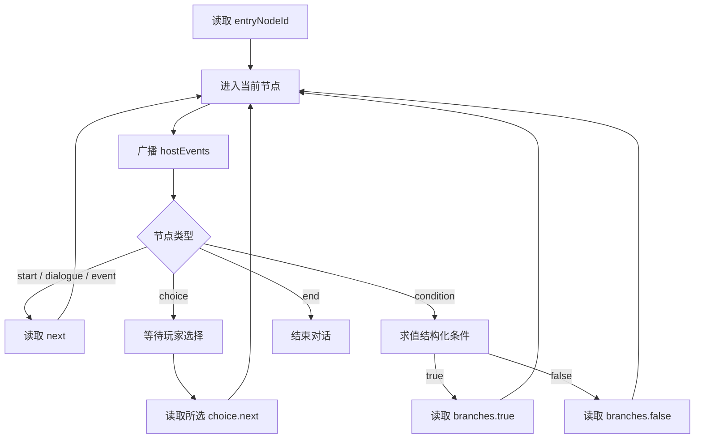
```mermaid
flowchart TD
    A["读取 entryNodeId"] --> B["进入当前节点"]
    B --> C["广播 hostEvents"]
    C --> D{"节点类型"}
    D -->|start / dialogue / event| E["读取 next"]
    D -->|choice| F["等待玩家选择"]
    F --> G["读取所选 choice.next"]
    D -->|condition| H["求值结构化条件"]
    H -->|true| I["读取 branches.true"]
    H -->|false| J["读取 branches.false"]
    D -->|end| K["结束对话"]
    E --> B
    G --> B
    I --> B
    J --> B
```

### 5.3 条件表达式

- 支持 `boolean`、`number`、`string`。
- 支持 `==`、`!=`、`>`、`>=`、`<`、`<=`。
- 支持 `all`、`any`、`not` 结构化组合。
- 字符串只允许相等和不等比较。
- 不解析或执行任意脚本文本。

## 六、全局状态与异常规范

| 状态           | 界面行为                   | 是否允许保存 | 是否允许导出         |
| -------------- | -------------------------- | ------------ | -------------------- |
| 正常           | 状态栏显示“项目正常”       | 是           | 是                   |
| 未保存         | 顶部显示脏状态圆点         | 是           | 先保存或明确继续     |
| 数据草稿未应用 | 数据视图显示“应用修改”     | 否           | 否                   |
| Schema 错误    | 显示行号和错误原因         | 否           | 否                   |
| 业务警告       | 问题面板显示警告           | 是           | 是，需明确提示       |
| 项目只读       | 所有编辑控件禁用           | 否           | 允许导出最后有效内容 |
| 外部修改       | 显示冲突处理提示           | 选择后决定   | 冲突解决前否         |
| 保存失败       | 保留当前编辑状态并显示原因 | 可重试       | 否                   |
| 导出成功       | Toast 展示格式和输出位置   | 不影响       | 已完成               |

## 七、非功能需求

### 7.1 性能

- 1,000 节点项目打开时间目标不超过 3 秒。
- 普通属性输入和节点选择反馈目标不超过 100 毫秒。
- 画布拖拽和缩放目标保持 50–60 FPS。
- 1,000 节点完整校验目标不超过 1 秒。
- 大列表使用虚拟化或按需渲染，不一次挂载全部复杂编辑器。

### 7.2 可靠性与安全

- 项目写入采用临时文件、刷盘和原子替换。
- 不执行项目 JSON 中的脚本、命令和动态代码。
- 路径解析防止越过允许根目录。
- 业务事件和宿主消息只作为声明式数据处理。
- Schema 迁移前创建备份，迁移失败不覆盖源文件。

### 7.3 可用性与可访问性

- 所有图标按钮提供可读标签和悬浮提示。
- 关键操作可通过键盘完成。
- Dark、Light 下文字、边界、选择和错误状态保持可辨识。
- 不只依赖颜色表达错误、真假分支和选择状态。
- 弹窗初始焦点、焦点循环和 Escape 行为一致。

## 八、MVP 验收总表

1. 能创建、移动和重新打开包含多份对话的本地项目。
2. 对话目录与磁盘相对路径一致，智能分组不改变真实路径。
3. 六类节点和合法连线均可通过画布创建、编辑、复制和删除。
4. 画布、表格、数据三视图往返后数据和选择状态一致。
5. 未选中节点时展示文件属性，选中节点后展示对应节点属性。
6. 角色、变量、业务事件、标签均有独立编辑器和引用保护。
7. UUID 自动生成且不可变，重复 UUID、Key 和悬空引用会阻止保存。
8. 选项和条件使用具名目标，运行时不存在无语义 `next` 数组。
9. 每个节点可配置多条宿主消息并按列表顺序广播。
10. 宿主消息和业务事件使用不同字段、校验及回调。
11. 项目支持默认语言、至少两种内容语言和固定回退规则。
12. 校验能定位结构错误、无效引用、不可达节点和潜在循环。
13. 模拟器能根据变量、条件和玩家选项稳定推进。
14. 项目设置使用可共享相对路径，用户设置不进入项目仓库。
15. Dark、Light 可即时切换、重新打开后恢复、重置后回到 Dark。
16. 运行时 JSON 不包含编辑器坐标，文本资源使用稳定键。
17. 桌面端和 CLI 的诊断及导出内容一致。
18. 保存失败和异常退出不会破坏最后有效项目文件。
19. Windows、macOS、Linux 均通过安装、打开、保存、导出和 CLI 冒烟测试。
20. 1,000 节点基准项目达到性能目标。

## 九、版本路线图

| 阶段    | 目标         | 主要交付                                               |
| ------- | ------------ | ------------------------------------------------------ |
| MVP 0.1 | 可编辑闭环   | 项目、目录、节点、资源、三视图、保存、主题             |
| MVP 0.2 | 可验证闭环   | 校验、模拟、多语言、宿主消息、恢复                     |
| MVP 1.0 | 可交付闭环   | JSON/XML/二进制导出、目录分片、CLI、迁移、三平台安装包 |
| 后续 1  | 引擎扩展     | Unity/UE 官方插件                                      |
| 后续 2  | 本地化与协作 | 编辑器界面多语言、翻译平台、云同步、实时协作           |
| 后续 3  | 生态扩展     | 第三方格式、运行时 SDK、插件体系                       |

## 十、需求追踪

| 产品能力         | 交互图       | 技术方案对应章节 |
| ---------------- | ------------ | ---------------- |
| 项目与目录       | 图 1、图 2   | 4.1、4.2、6.1    |
| 项目搜索         | 图 3         | 4.3              |
| 四类资源         | 图 4–7       | 4.4              |
| 项目与用户设置   | 图 8–10      | 4.5              |
| 画布、表格、数据 | 图 11–13     | 4.6、4.7         |
| 文件与节点属性   | 图 14        | 4.8              |
| 多宿主消息       | 图 15        | 5.6、6.4         |
| 校验与模拟       | 图 16、图 17 | 4.9、4.10        |
| 导出与 CLI       | 图 18、图 19 | 4.12、4.13       |
